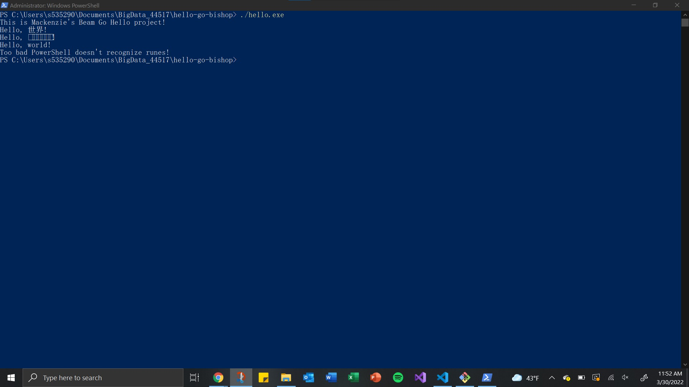

# hello-go-bishop

## Project Notes
After successfully initalizing go.mod and creating the project, I was able to produce a string of output messages in Powershell using a simple command, `.\hello.exe`.

Output from the command is posted below: 

The most difficult part about this assignment was configuring my GOPATH to allow this command to run in other locations on my machine.